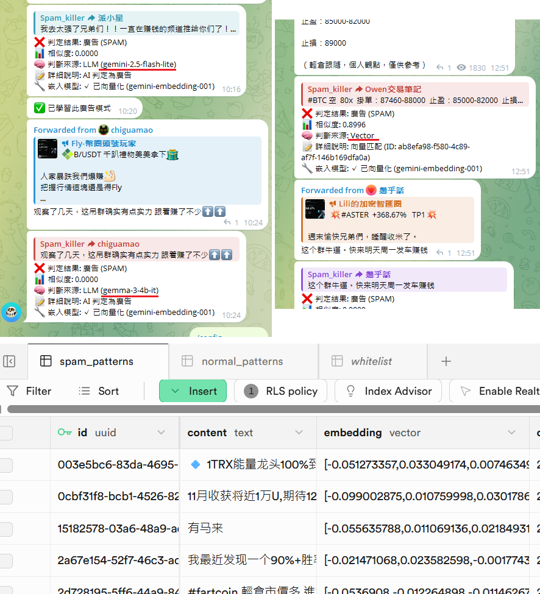

# SpamKiller: 基於向量語意與 LLM 的 Serverless TG 防廣告機器人

SpamKiller 是一個輕量、自動學習，且可即時手動調校的 Telegram 防廣告機器人。

它結合了向量語意比對（Vector Search）與大語言模型（LLM）判定，旨在以最低成本實現精準的廣告攔截機制。

本專案基於 **Serverless** 架構，支援 Cloudflare Workers 部署，適合小型群組在免費額度內運行。



## 🌟 核心設計與偵測機制

機器人採用「雙層過濾 + 持續學習」的判定邏輯：

1.  **第一層：向量語意比對 (Vector Match)**
    *   **機制**：利用 `gemini-embedding-001` 將訊息轉化為 768 維度的向量。
    *   **比對**：將該向量與 Supabase 資料庫中的已知廣告模式進行相似度比對。
    *   **優勢**：速度極快且成本極低。如果相似度超過門檻（預設 0.85），則直接判定為廣告並攔截。

2.  **第二層：LLM 深入分析 (AI Analysis)**
    *   **機制**：若向量庫無匹配，則調用 `gemini-2.5-flash-lite` 或 `gemma-3-4b`模型幫助判定。
    *   **自動學習**：若 AI 判定為廣告，機器人會**自動**將該訊息與向量存入資料庫，提升第一層比對的覆蓋率。

3.  **人工輔助教學 (Manual Teaching)**
    *   管理員可手動標記訊息，直接校正偵測模型，實現即時演進。

## 🛠️ 技術棧

*   **Runtime**: [Cloudflare Workers](https://workers.cloudflare.com/)
*   **Database**: [Supabase](https://supabase.com/) (pgvector)
*   **AI Models**: Google AI Studio (Gemini)
*   **Framework**: [Telegraf](https://telegraf.js.org/) (Telegram Bot API)
*   **Language**: TypeScript

## 🚀 部署教學

### 1. 資料庫準備 (Supabase)
1. 建立一個新的 Supabase 專案。
2. 在 SQL Editor 中執行專案根目錄下的 [supabase_recreate_all.sql](./supabase_recreate_all.sql)。
    >[!Warning]此腳本會清空現有資料表並重建。

### 2. 環境變數設定
您可以透過 Wrangler 或在 Cloudflare Dashboard 設定以下變數：
    `TG_TOKEN`：Telegram Bot Token (從 @BotFather 取得)
    `SUPABASE_URL`：Supabase 專案連結
    `SUPABASE_SERVICE_KEY`：Supabase Service Role Key (秘密金鑰)
    `GEMINI_API_KEY`：Google AI Studio API Key


### 3. 部署至 Cloudflare
安裝依賴
```
npm install
```
部署
```
npx wrangler deploy
```

### 4. 設定 Webhook
部署完成後，打開以下 URL 啟用 Webhook (替換為您的Bot token)：
`https://api.telegram.org/bot<TG_BOT_TOKEN>/setWebhook?url=<YOUR_WORKER_URL>`

## 💻 指令手冊

### 管理指令 (僅限管理員)
*   `/monitor [add|remove|list]`：管理監控群組。不帶參數在群組內使用則為切換監控狀態。
*   `/config`：查看目前所有設定項。
*   `/config [key] [value]`：修改設定（如 `threshold 3`, `dry_run true`）。
*   `/whitelist`：(回覆訊息) 將該使用者加入白名單。
*   `/spam`：(回覆訊息) 標記訊息為廣告並存入向量庫，刪除訊息並累計違規。
*   `/normal`：(回覆訊息) 標記訊息為正常訊息以改善資料庫。

### 系統指令
*   `/status`：查看機器人連線狀態與當前群組監控狀態。
*   `/help`：顯示完整指令說明清單。
*   `/ping`：診斷連線與顯示 User ID。

### 限制與成本

*   **免費額度**：依賴 Google AI Studio 的免費 API 額度。若觸發頻率限制 (Rate Limit)，機器人會暫時失效並放行訊息。
*   **初始資料**：全新的機器人向量庫為空，初期的攔截完全依賴 LLM。